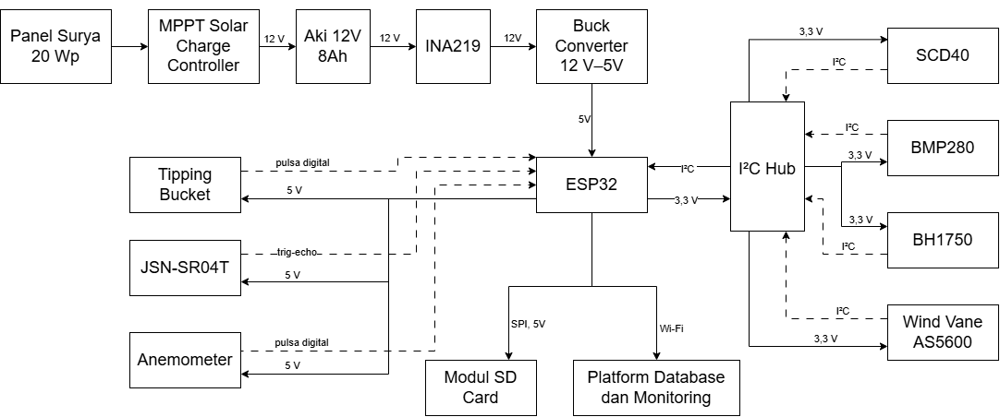
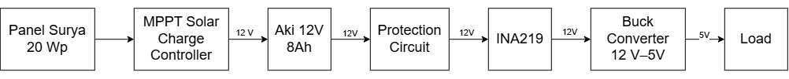
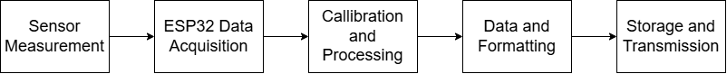
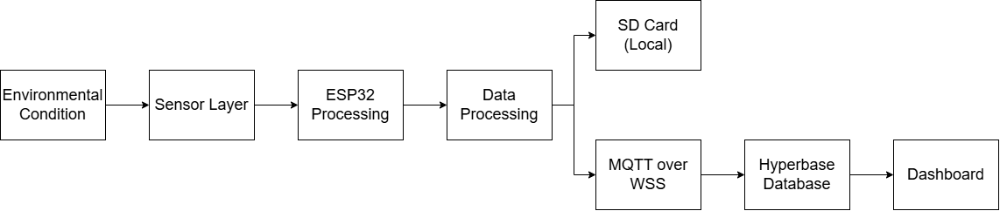

# 
System Architecture

## Overview

The Miniweather Station is an IoT-based environmental monitoring system developed using ESP32 as the main processing unit. The system is designed to periodically acquire, process, store, and transmit environmental data from multiple sensors.

The architecture integrates several subsystems, including:

- Power supply and energy management system
- Environmental sensing system
- Embedded processing system
- Local data storage system
- Wireless communication and cloud monitoring system

The developed architecture enables autonomous outdoor operation by combining solar energy harvesting, local data backup, and cloud-based monitoring.

---

# 2.1 Overall System Architecture

Figure 2.1 Overall system architecture of the ESP32-based Miniweather Station.

The Miniweather Station architecture consists of four main layers:

1. Power Layer
2. Sensor Layer
3. Processing and Data Management Layer
4. Communication and Monitoring Layer

Each layer performs a specific function while working together as an integrated environmental monitoring system.

---

# 2.2 Power Layer

The power layer provides electrical energy required for continuous operation of the weather station.

The power subsystem consists of:

- 20 Wp solar panel
- MPPT solar charge controller
- 12V 8Ah battery
- Protection circuit
- INA219 power monitoring sensor
- XL7015 buck converter

The power flow is:

  

Figure 2.2 Power flow of the ESP32-based Miniweather Station.

The solar panel functions as the primary energy source, while the battery provides energy storage to maintain system operation when solar input is unavailable.

The protection circuit consists of:

- Fuse for overcurrent protection
- SS34 Schottky diode for reverse polarity protection
- TVS diode for transient voltage suppression

The INA219 module measures the electrical parameters of the system, including:

- Voltage
- Current
- Power consumption

The XL7015 buck converter regulates the battery voltage from 12V to 5V for the ESP32 and supporting electronic components.

---

# 2.3 Sensor Layer

The sensor layer is responsible for collecting environmental parameters from the surrounding environment.

The system integrates multiple sensors with different communication interfaces.

## I2C Sensor Network

The following sensors communicate with ESP32 through the I2C interface:

| Sensor | Measurement |
|---|---|
| SCD40 | CO₂ concentration, temperature, humidity |
| BMP280 | Atmospheric pressure and altitude |
| BH1750 | Light intensity |
| AS5600 | Wind direction angle |

An I2C hub is implemented to simplify sensor integration and allow multiple sensors to share the same communication bus.

The I2C communication architecture provides:

- Reduced wiring complexity
- Modular sensor integration
- Easy sensor expansion

## Digital Pulse Sensors

Several sensors generate digital signals that are processed directly by ESP32.

These sensors include:

| Sensor | Signal Type | Measurement |
|---|---|---|
| Anemometer | Digital pulse | Wind speed |
| Tipping Bucket | Digital pulse | Rainfall accumulation |

The ESP32 counts pulse events within a measurement interval to determine wind speed and rainfall values.

---

# 2.4 Processing Layer

The processing layer is centered around the ESP32 microcontroller.

ESP32 functions as the main controller responsible for:

- Sensor data acquisition
- Sensor calibration
- Data processing
- Measurement interval management
- Data formatting
- Communication control

The processing sequence is:

Figure 2.3 Processing sequence of the ESP32-based Miniweather Station.

The ESP32 communicates with sensors through:

- I2C interface
- GPIO digital input
- SPI interface for SD card

The firmware controls the complete measurement cycle with a periodic interval of 60 seconds.

---

# 2.5 Local Storage Layer

The system implements a microSD card module as local data storage.

The SD card provides data backup capability to ensure measurement continuity during communication interruptions.

The local storage system provides several advantages:

- Prevents data loss during internet failure
- Enables offline data retrieval
- Supports long-term field measurement

The SD card operates as a backup data repository while the primary monitoring system uses wireless communication.

---

# 2.6 Communication and Monitoring Layer

The communication layer enables remote monitoring through wireless connectivity.

The system uses:

- WiFi communication
- MQTT protocol
- MQTT over WebSocket Secure (WSS)
- Hyperbase monitoring platform

The Hyperbase platform provides:

- Real-time monitoring dashboard
- Historical database storage
- Environmental data visualization

When internet connectivity is unavailable, the system continues measurement and stores data locally using the SD card.

---

# 2.7 Data Flow

The complete data acquisition and monitoring process follows these steps:

1. Environmental parameters are measured by sensors.
2. Sensor data is acquired by ESP32.
3. Raw measurements are processed and calibrated.
4. Measurement results are formatted into JSON data.
5. Data is stored locally in the microSD card.
6. ESP32 transmits data through MQTT communication.
7. Hyperbase receives and stores measurement data.
8. Data is visualized through the monitoring dashboard.

The complete data flow is illustrated below:

  
  

Figure 2.4 Data flow of the ESP32-based Miniweather Station.

---

# 2.8 System Operation Summary

The Miniweather Station operates as an autonomous IoT monitoring node.

During operation:

- Solar energy is converted and stored in the battery.
- Sensors periodically acquire environmental parameters.
- ESP32 processes and manages measurement data.
- Data is stored locally for reliability.
- Wireless communication transfers data to Hyperbase.
- Users can monitor environmental conditions remotely.

The modular architecture allows future expansion of additional sensors and improvement of system functionality without major modification to the existing platform.
