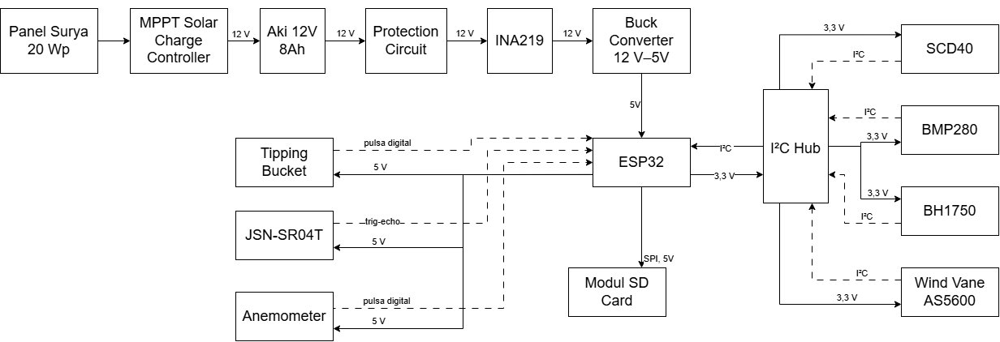
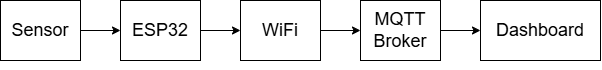

# Hardware Design

## Overview

The hardware design of the Miniweather Station focuses on developing a modular, compact, and reliable embedded system for environmental monitoring applications.

The system is designed around an ESP32 microcontroller as the main processing unit, with multiple environmental sensors integrated through digital communication interfaces. The hardware architecture supports periodic measurement, local data storage, wireless communication, and autonomous operation using a battery-based power system.

The design consists of four main subsystems:

1. Sensor acquisition subsystem
2. Processing and control subsystem
3. Data storage and communication subsystem
4. Power management subsystem

---

# Hardware Architecture

The overall hardware architecture is shown below:

Figure 3.1 Hardware architecture of the ESP32-based Miniweather Station.

The ESP32 acts as the central controller that collects measurement data from multiple sensors, processes the acquired information, stores the data locally, and communicates with external monitoring platforms.

---

# Main Controller

## ESP32 Development Board

The ESP32 is selected as the main controller due to its integrated WiFi capability, sufficient processing performance, multiple GPIO availability, and support for various communication protocols.

Main functions of ESP32:

- Sensor data acquisition
- Data processing
- Communication management
- SD card data logging
- Power management control

## Main Specifications

| Parameter | Specification |
|-----------|---------------|
| Microcontroller | ESP32 |
| Operating Voltage | 3.3 V |
| Communication | WiFi, Bluetooth |
| Interface | I2C, SPI, GPIO |
| Programming Platform | Arduino IDE |

---

# Sensor Integration

The weather station integrates multiple sensors to monitor environmental conditions.

## I2C Sensor Network

Several sensors communicate with ESP32 using the I2C protocol.

The I2C bus consists of:

| Sensor | Measurement | Interface |
|--------|-------------|-----------|
| SCD40 | Temperature, humidity, CO₂ | I2C |
| BMP280 | Atmospheric pressure and altitude | I2C |
| BH1750 | Light intensity | I2C |
| AS5600 | Wind direction angle | I2C |

The use of a shared I2C bus improves modularity and reduces the required number of ESP32 GPIO pins.

---

# Digital Input Sensors

## Wind Speed Measurement

The anemometer is connected to the ESP32 through a digital input interface.

The wind speed measurement is based on pulse counting:

- Each rotation generates electrical pulses.
- ESP32 counts pulses within a measurement interval.
- Pulse frequency is converted into wind speed.

---

## Rainfall Measurement

The tipping bucket rain gauge is connected using an interrupt-based GPIO input.

Measurement principle:

1. Rainwater fills the tipping bucket.
2. The bucket tilts after reaching a certain volume.
3. Each tipping event generates a pulse.
4. ESP32 calculates rainfall accumulation.

---

# Data Storage System

## MicroSD Card Module

A microSD card is implemented as local storage to improve system reliability.

The SD card provides:

- Offline measurement storage
- Backup data logging
- Data recovery during communication failure

Communication interface:

| Component | Interface |
|-----------|-----------|
| MicroSD Card | SPI |

---

# Communication Interface

## WiFi Communication

The ESP32 provides wireless connectivity for remote monitoring.

The communication process:

Figure 3.2 Communication process of the ESP32-based Miniweather Station.

---

# PCB and Circuit Design

## PCB Design Consideration

The custom PCB design considers:

- Sensor modularity
- Stable power distribution
- Noise reduction
- Easy maintenance
- Compact installation

Important PCB design aspects:

### Power Distribution

The power supply section separates:

- Main power input
- Voltage regulation
- Sensor supply
- ESP32 supply

### Ground Plane

A common ground plane is implemented to:

- Reduce electrical noise
- Improve signal integrity
- Provide a stable reference voltage

### Decoupling Capacitors

Decoupling capacitors are installed near active components:

- ESP32 power input
- Sensor supply lines
- Voltage regulator output

The capacitors reduce voltage fluctuation caused by dynamic current changes.

---

# Mechanical Design

## Enclosure Design

The weather station enclosure is designed to protect electronic components from environmental exposure while maintaining sensor measurement accuracy.

Design considerations:

- Weather protection
- Sensor ventilation
- Cable management
- Ease of assembly
- 3D printing feasibility

## Sensor Placement

Sensor placement follows environmental measurement requirements:

- Temperature and humidity sensors are installed inside a ventilated enclosure.
- Light sensor is positioned to receive ambient radiation.
- Wind sensors are mounted in exposed locations.
- Rain gauge is placed in an unobstructed area.

---

# Power System Design

The weather station is designed for autonomous operation using renewable energy.

The power architecture consists of:

Figure 3.3 Power flow of the ESP32-based Miniweather Station.

## Power Components

| Component | Function |
|-----------|----------|
| Solar Panel | Energy generation |
| Battery | Energy storage |
| Buck Converter | Voltage regulation |
| ESP32 | System controller |
| Sensors | Environmental measurement |

---

# Hardware Development Process

The hardware development follows these stages:

1. System requirement analysis
2. Sensor selection
3. Circuit design
4. PCB development
5. Mechanical enclosure design
6. Hardware assembly
7. Functional testing

---

# Hardware Future Improvements

Potential hardware improvements:

- Improved waterproof enclosure
- Integrated custom PCB with power management circuit
- Lower-power operating mode
- Industrial-grade sensor integration
- Improved solar energy harvesting system
