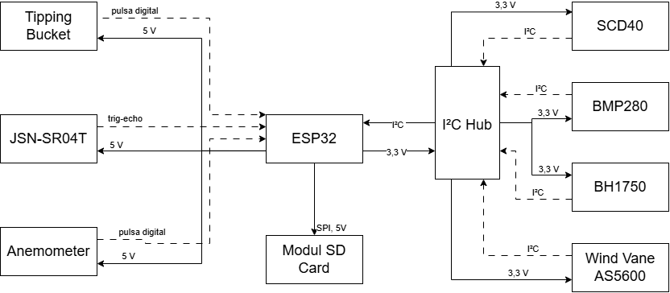
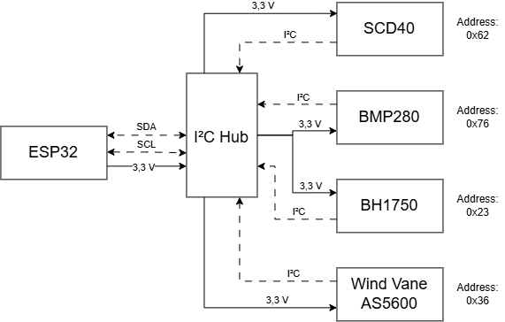
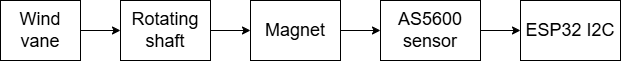
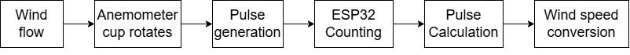
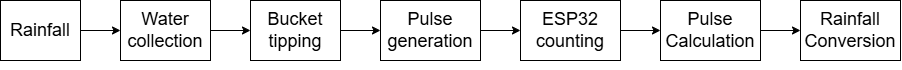
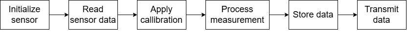

# Sensor Configuration

## Overview

The Miniweather Station integrates multiple sensors to monitor atmospheric and environmental parameters. The sensor configuration is designed using a modular architecture, allowing each measurement component to be independently integrated, tested, and replaced.

The ESP32 microcontroller acts as the central data acquisition unit, receiving measurement data from sensors through several communication interfaces, including I2C, SPI, and GPIO-based pulse measurement.

The implemented sensors are selected based on measurement accuracy, power consumption, communication compatibility, and suitability for continuous environmental monitoring.

---

# Sensor Architecture

Figure 4.1 Sensor architecture of the ESP32-based Miniweather Station.

The sensor subsystem consists of:

- Environmental monitoring sensors
- Weather parameter sensors
- Data acquisition interface
- Signal processing system

The measurement parameters include:

| Parameter | Sensor | Measurement Unit |
|-----------|--------|------------------|
| Air temperature | SCD40 | °C |
| Relative humidity | SCD40 | %RH |
| Carbon dioxide concentration | SCD40 | ppm |
| Atmospheric pressure | BMP280 | hPa |
| Estimated altitude | BMP280 | m |
| Light intensity | BH1750 | lux |
| Wind direction | AS5600 | degree |
| Wind speed | Anemometer | m/s |
| Rainfall | Tipping Bucket | mm |

---

# Sensor Communication Interface

Figure 4.2 I2C bus diagram of the ESP32-based Miniweather Station.

The weather station uses several communication methods:

| Interface | Sensor | Function |
|-----------|--------|----------|
| I2C | SCD40 | Temperature, humidity, CO₂ |
| I2C | BMP280 | Pressure measurement |
| I2C | BH1750 | Light measurement |
| I2C | AS5600 | Wind direction |
| GPIO Interrupt | Anemometer | Wind speed pulse counting |
| GPIO Interrupt | Tipping Bucket | Rainfall measurement |
| SPI | MicroSD | Local data storage |

The use of digital communication interfaces improves measurement stability and reduces wiring complexity.

---

# Environmental Sensor Configuration

## SCD40 Air Quality Sensor

The SCD40 is used for measuring atmospheric conditions consisting of:

- Carbon dioxide concentration
- Air temperature
- Relative humidity

### Measurement Principle

The CO₂ concentration is measured using photoacoustic NDIR technology. The sensor detects infrared absorption characteristics of carbon dioxide molecules and converts the signal into CO₂ concentration.

### Interface

| Parameter | Specification |
|-|-|
| Communication | I2C |
| Address | 0x62 |
| Supply Voltage | 3.3 V |

### Output Data

The sensor provides:
Temperature (°C)
Humidity (%RH)
CO₂ concentration (ppm)

---

# Atmospheric Pressure Sensor

## BMP280

The BMP280 is used to measure atmospheric pressure and estimate elevation changes.

### Measurement Parameters

| Parameter | Unit |
|-|-|
| Pressure | hPa |
| Altitude | m |

### Interface

| Parameter | Specification |
|-|-|
| Communication | I2C |
| Address | 0x76 |
| Supply Voltage | 3.3 V |

### Altitude Calculation

The altitude estimation is calculated from atmospheric pressure:

\[
h = 44330(1-(P/P_0)^{0.1903})
\]

where:

- h = altitude estimation
- P = measured pressure
- P₀ = reference sea level pressure

---

# Light Intensity Sensor

## BH1750

The BH1750 is used to measure ambient light intensity around the weather station.

### Measurement Parameter

| Parameter | Unit |
|-|-|
| Light intensity | lux |

### Interface

| Parameter | Specification |
|-|-|
| Communication | I2C |
| Address | 0x23 |

### Application

The light intensity measurement can be used for:

- Environmental condition monitoring
- Solar radiation approximation
- Solar energy system evaluation

---

# Wind Direction Measurement

## AS5600 Magnetic Angle Sensor

Figure 4.3 Wind direction measurement of the ESP32-based Miniweather Station.

The AS5600 is implemented as a digital wind vane sensor. The sensor detects angular rotation from a magnet attached to the rotating wind vane mechanism.

### Measurement Principle

The permanent magnet rotation changes the magnetic field detected by the AS5600 sensor. The angular position is then converted into wind direction.

### Specification

| Parameter | Value |
|-|-|
| Interface | I2C |
| Resolution | 12-bit |
| Range | 0–360° |

### Angle Conversion

The raw angular value is converted into degrees:

\[
Direction=\frac{Angle_{raw}}{4096}\times360
\]

The resulting angle is interpreted as wind direction:

| Angle | Direction |
|-|-|
| 0° | North |
| 90° | East |
| 180° | South |
| 270° | West |

---

# Wind Speed Measurement

## Anemometer

Figure 4.4 Wind speed measurement of the ESP32-based Miniweather Station.

  
The anemometer measures wind velocity using rotational movement.

### Measurement Principle

Wind causes the cup mechanism to rotate. Each rotation produces electrical pulses that are detected by ESP32.

The measurement process:

1. Detect pulse signal.
2. Count pulses within sampling interval.
3. Convert pulse frequency into wind speed.

### Interface

| Parameter | Specification |
|-|-|
| Signal | Digital pulse |
| Processing | GPIO interrupt |

### Wind Speed Calculation

\[
V=K \times f
\]

where:

- V = wind speed
- K = calibration constant
- f = pulse frequency

---

# Rainfall Measurement

## Tipping Bucket Rain Gauge

Figure 4.4 Rainfall measurement of the ESP32-based Miniweather Station.

The tipping bucket sensor measures accumulated rainfall based on tipping events.

### Measurement Principle

The rain collector fills the bucket until a predefined volume is reached. The bucket then tips and generates an electrical pulse.

### Interface

| Parameter | Specification |
|-|-|
| Signal | Digital pulse |
| Processing | GPIO interrupt |

### Rainfall Calculation

\[
Rainfall=N \times C
\]

where:

- N = number of tipping events
- C = rainfall coefficient

---

# Sensor Data Acquisition Process

The ESP32 performs periodic sensor acquisition through the following process:

Figure 4.5 Sensor data flow of the ESP32-based Miniweather Station.

---

# Sensor Calibration and Validation

Sensor calibration is performed to improve measurement reliability.

The calibration approach includes:

## Offset Correction

Used when the sensor has a constant measurement deviation.

\[
X_{corrected}=X_{measured}+Offset
\]

## Reference Comparison

Sensor measurements are compared with reference instruments under similar environmental conditions.

Calibration parameters are stored in the firmware to ensure consistent measurement output.

---

# Sensor Expansion Capability

The modular sensor architecture allows future integration of additional sensors, including:

- Solar radiation sensor
- Particulate matter sensor
- Soil moisture sensor
- Soil temperature sensor
- UV radiation sensor

This modular approach allows the weather station to be adapted for different environmental monitoring applications.
