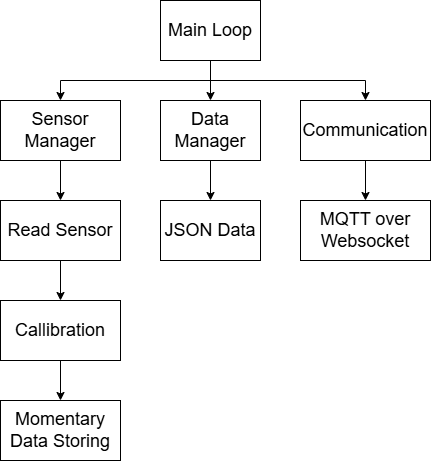
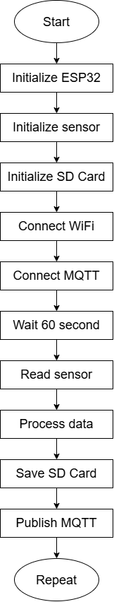

# Firmware Design

## Overview

The firmware is developed to control the operation of the ESP32-based Miniweather Station. The firmware acts as the main control layer that manages sensor acquisition, data processing, local data storage, wireless communication, and system monitoring.

The firmware is designed using a periodic measurement approach, where environmental parameters are collected every 60 seconds. The system prioritizes measurement reliability by implementing local data logging through a microSD card and maintaining data availability during network interruptions.

The firmware architecture consists of several functional layers:

1. Hardware initialization layer
2. Sensor acquisition layer
3. Data processing layer
4. Data storage layer
5. Communication layer
6. System monitoring layer

---

# Firmware Architecture



The firmware architecture follows a modular structure where each subsystem performs a specific task.


---

# Firmware Operation Flow




The general firmware operation follows the sequence:


---

# Hardware Initialization Layer

During system startup, the firmware initializes all required hardware components.

The initialization process includes:

- ESP32 GPIO configuration
- I2C communication initialization
- SPI communication initialization
- Sensor initialization
- SD card initialization
- Network configuration


The initialization stage ensures that all connected hardware components are ready before the measurement process begins.

---

# Sensor Acquisition Layer

The sensor acquisition layer manages the retrieval of environmental parameters from connected sensors.

The firmware periodically collects:

| Parameter | Sensor |
|-|-|
| Temperature | SCD40 |
| Relative humidity | SCD40 |
| CO₂ concentration | SCD40 |
| Atmospheric pressure | BMP280 |
| Altitude estimation | BMP280 |
| Light intensity | BH1750 |
| Wind direction | AS5600 |
| Wind speed | Anemometer |
| Rainfall | Tipping bucket |
| Electrical parameters | INA219 |


Sensor reading is performed according to the measurement interval to maintain consistent sampling time and reduce unnecessary power consumption.

---

# Data Processing Layer

After sensor acquisition, the raw measurement data is processed before storage and transmission.

The processing stage includes:

- Sensor calibration
- Unit conversion
- Data filtering
- Data formatting
- Measurement validation


The processed values are converted into a structured data format for further storage and communication.

---

# Local Data Storage

## MicroSD Data Logging

The firmware implements local data logging using a microSD card.

The purpose of local storage is:

- Prevent data loss during communication failure
- Provide measurement backup
- Enable offline data retrieval


The logging mechanism allows the weather station to continue operating even when WiFi or MQTT communication is unavailable.

Data storage sequence:


---

# Wireless Communication Layer

## MQTT Communication

The firmware uses MQTT protocol to transmit measurement data from the ESP32 to the monitoring platform.

The communication architecture:


MQTT communication is used because it provides:

- Lightweight message transmission
- Efficient IoT communication
- Reliable data exchange


---

# Data Transmission Strategy

The firmware applies an independent storage and communication approach.

The measurement cycle:

1. Sensor data is acquired.
2. Data is processed.
3. Data is stored locally.
4. Data transmission is attempted.
5. System continues to the next measurement cycle.


If communication fails:


This approach ensures measurement continuity regardless of network availability.

---

# Data Format

The firmware packages measurement results into structured JSON format before transmission.

Example:

```json
{
  "temperature": 28.5,
  "humidity": 72.4,
  "co2": 450,
  "pressure": 1012.5,
  "wind_direction": 180,
  "wind_speed": 2.1,
  "rainfall": 0
}
