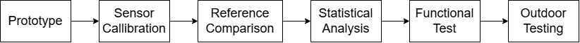
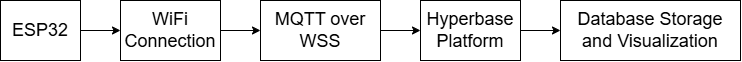

# Calibration and Testing

## 8.1 Overview

The Miniweather Station undergoes calibration and testing procedures to evaluate measurement accuracy, system functionality, and operational reliability.

The validation process is conducted by comparing the developed weather station measurements with reference instruments and commercial environmental measurement devices.

The testing process consists of:

- Sensor calibration and validation
- Statistical performance evaluation
- Hardware and firmware functional testing
- Communication verification
- Outdoor deployment evaluation

The objective of this validation process is to ensure that the developed system can provide reliable environmental measurements for continuous outdoor monitoring applications.

---

# 8.2 Calibration Workflow

The calibration and testing workflow consists of several stages, starting from prototype verification until outdoor deployment evaluation.

  

Figure 8.1 Calibration workflow of the ESP32-based Miniweather Station.

The calibration workflow consists of the following stages:

### 1. Prototype Verification

The developed hardware and firmware are initially verified to ensure that all system components operate properly.

The verification includes:

- ESP32 operation
- Sensor communication
- Data acquisition process
- SD card data logging
- MQTT communication

---

### 2. Sensor Calibration

Each sensor is evaluated by comparing the measurement results from the Miniweather Station with reference instruments.

The calibration process is performed to determine:

- Measurement deviation
- Sensor accuracy
- Calibration coefficient
- Correlation between developed sensor and reference measurement

---

### 3. Statistical Evaluation

The calibration results are analyzed using statistical performance indicators.

The evaluation parameters include:

| Parameter | Description |
|---|---|
| R² | Correlation between sensor measurement and reference value |
| MAPE | Mean percentage measurement error |
| MAE | Mean absolute measurement error |
| RMSE | Root mean square error |

---

### 4. Functional Testing

The complete system functionality is evaluated after sensor calibration.

The functional testing includes:

- Sensor data acquisition
- Data processing
- SD card storage
- MQTT communication
- Dashboard visualization

---

### 5. Outdoor Deployment Testing

After calibration and functional verification, the weather station is deployed at the DTNTF rooftop for continuous outdoor monitoring.

The deployment evaluation focuses on:

- Sensor stability
- Power system reliability
- Communication performance
- Long-term measurement consistency

---

# 8.3 Sensor Calibration Method

The Miniweather Station integrates multiple sensors with different measurement characteristics.

Each sensor is validated using a suitable reference instrument.

The calibration methods are summarized below.

| Sensor | Parameter | Reference Instrument | Calibration Method |
|---|---|---|---|
| SCD40 | Temperature | Reference thermometer | Direct comparison and regression analysis |
| SCD40 | Relative humidity | Reference hygrometer | Direct comparison and regression analysis |
| SCD40 | CO₂ concentration | Reference CO₂ measurement device | Measurement correlation analysis |
| BMP280 | Atmospheric pressure | Reference pressure measurement | Pressure comparison |
| BMP280 | Altitude estimation | Altimeter | Altitude comparison |
| BH1750 | Illuminance | Commercial envirometer | Lux comparison |
| AS5600 | Wind direction | Magnetic compass | Zero-angle alignment and directional correction |
| Anemometer | Wind speed | Commercial envirometer | Wind speed comparison |
| Tipping bucket | Rainfall | Controlled rainfall testing | Pulse and accumulation validation |

---

# 8.4 Calibration Performance Result

The calibration performance is evaluated using measurement error parameters.

The results are summarized below.

| Parameter | Reference Range | Mean Error | MAPE | MAE | RMSE |
|---|---|---|---|---|---|
| Temperature | 23.40–40.50 °C | −0.17 °C | 0.57% | 0.17 °C | 0.21 °C |
| Relative Humidity | 43.20–90.20 %RH | +1.18 %RH | 1.83% | 1.23 %RH | 1.56 %RH |
| CO₂ Concentration | 1510–3440 ppm | −119.50 ppm | 5.23% | 119.50 ppm | 122.61 ppm |
| Atmospheric Pressure | 996.10–996.80 hPa | −0.98 hPa | 0.10% | 0.98 hPa | 0.99 hPa |
| Altitude Estimation | 146.10–173.00 m | −5.40 m | 3.45% | 5.40 m | 5.42 m |
| Illuminance | 13–52,500 lux | +37.30 lux | 5.22% | 651.70 lux | 927.67 lux |
| Rainfall | 0.70–3.90 mm | +0.07 mm | 11.76% | 0.23 mm | 0.29 mm |
| Wind Speed | 0.61–7.01 m/s | −0.17 m/s | 7.27% | 0.23 m/s | 0.32 m/s |
| Wind Direction | 2–337° | −8.10° | 40.92%* | 10.70° | 12.78° |
| Water Level Distance | 0.00–24.30 cm | — | — | — | — |

\*The MAPE value for wind direction is influenced by the circular characteristic of angular measurement, where small directional differences can produce relatively large percentage errors.

---

# 8.5 Regression Analysis

Linear regression analysis is performed to evaluate the relationship between the developed sensor output and reference measurements.

The regression model is expressed as:

\[
y=ax+b
\]

where:

- \(a\) represents the slope
- \(b\) represents the intercept
- \(R^2\) represents the correlation coefficient

| Parameter | Regression Equation | Slope | Intercept | R² |
|---|---|---|---|---|
| Temperature | y = 0.9976x − 0.0896 | 0.9976 | −0.0896 | 0.9995 |
| Relative Humidity | y = 1.0186x − 0.0879 | 1.0186 | −0.0879 | 0.9948 |
| CO₂ Concentration | y = 1.0058x − 134.3519 | 1.0058 | −134.3519 | 0.9987 |
| Atmospheric Pressure | y = 1.1781x − 178.3727 | 1.1781 | −178.3727 | 0.9053 |
| Altitude Estimation | y = 0.9641x + 0.2240 | 0.9641 | +0.2240 | 0.9960 |
| Illuminance | y = 1.0021x − 4.7057 | 1.0021 | −4.7057 | 0.9973 |
| Water Level Distance | y = −1.0257x + 88.00 | −1.0257 | +88.00 | 0.9867 |
| Rainfall | y = 1.1678x − 0.2808 | 1.1678 | −0.2808 | 0.9655 |
| Wind Speed | y = 0.8858x + 0.1804 | 0.8858 | +0.1804 | 0.9885 |
| Wind Direction | y = 0.9618x − 2.0622 | 0.9618 | −2.0622 | 0.9937 |

---

# 8.6 Functional Testing

Functional testing is performed to verify that all hardware and software components operate correctly.

| Test Item | Acceptance Criteria | Result |
|---|---|---|
| ESP32 operation | Controller operates continuously | Passed |
| Sensor acquisition | All sensors provide measurement data | Passed |
| SD card logging | Measurement data stored successfully | Passed |
| MQTT communication | Data transmitted successfully | Passed |
| Hyperbase visualization | Data displayed correctly | Passed |

---

# 8.7 Communication Testing

The communication system is tested to verify the data transmission process from the weather station to the monitoring platform.

The testing includes:

- WiFi connection establishment
- MQTT connection verification
- Data transmission verification
- Hyperbase dashboard monitoring

The communication workflow:

  

Figure 8.2 Hyperbase dashboard during Miniweather Station testing.

---

# 8.8 Outdoor Deployment Testing

After calibration and functional verification, the Miniweather Station was deployed at the DTNTF rooftop for continuous field testing.

The deployment condition is:

| Parameter | Description |
|---|---|
| Location | DTNTF Rooftop |
| Operation Mode | Continuous monitoring |
| Weather Condition | Mostly sunny |
| Testing Status | Ongoing |

The outdoor evaluation aims to observe:

- Long-term sensor stability
- Reliability of power supply
- Data transmission consistency
- Environmental response under real conditions

  

Figure 8.3 Outdoor deployment of the ESP32-based Miniweather Station.

---

# 8.9 Future Testing Improvement

Future testing improvements include:

- Long-term accuracy evaluation
- Comparison with official weather station data
- Communication latency measurement
- Packet loss analysis
- Automated calibration procedures
- Seasonal environmental testing
